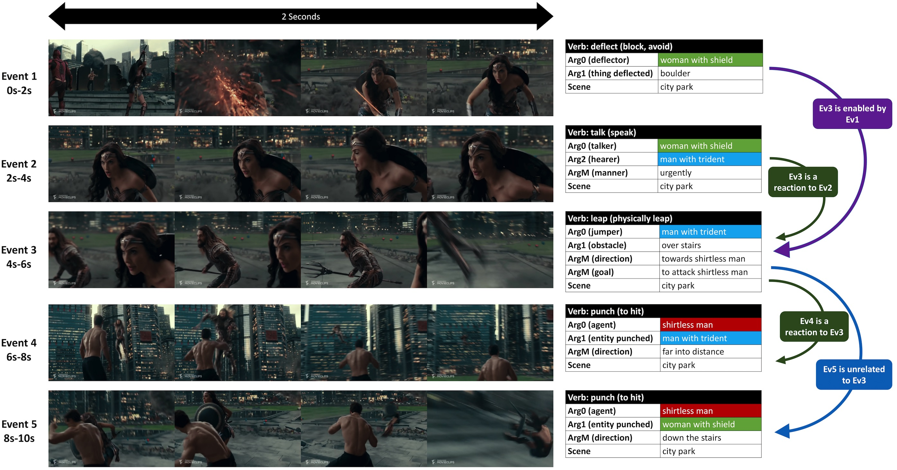

# Visual Semantic Role Labeling for Video Understanding (CVPR21)
[](https://github.com/TheShadow29/VidSitu/blob/master/LICENSE)
[](https://www.python.org/)

[](https://arxiv.org/abs/2104.00990)

**[Visual Semantic Role Labeling for Video Understanding](https://arxiv.org/abs/2104.00990)**<br>
[Arka Sadhu](https://theshadow29.github.io/), [Tanmay Gupta](http://tanmaygupta.info/), [Mark Yatskar](http://markyatskar.com/), [Ram Nevatia](https://sites.usc.edu/iris-cvlab/professor-ram-nevatia/), [Aniruddha Kembhavi](https://anikem.github.io/)<br>
[CVPR 2021](http://cvpr2021.thecvf.com/)

VidSitu is a large-scale dataset containing diverse 10-second videos from movies depicting complex situations (a collection of related events). Events in the video are richly annotated at 2-second intervals with verbs, semantic-roles, entity co-references, and event relations.



This repository includes:

1. Instructions to install, download and process VidSitu Dataset.
2. Code to run all experiments provided in the paper along with log files.
3. Instructions to submit results to the Leaderboard.

# Download

Please see [DATA_PREP.md](./data/DATA_PREP.md) for detailed instructions on downloading and setting up the dataset.

# Installation

Please see [INSTALL.md](./INSTALL.md) for detailed instructions


# Training

- Basic usage is `CUDA_VISIBLE_DEVICES=$GPUS python main_dist.py "experiment_name" --arg1=val1 --arg2=val2` and the arg1, arg2 can be found in `configs/vsitu_cfg.yml`.

- Set `$GPUS=0` for single gpu training. For multi-gpu training via Pytorch Distributed Data Parallel use `$GPUS=0,1,2,3`

- YML has a hierarchical structure which is supported using `.`
    For instance, if you want to change the `beam_size` under `gen` which in the YML file looks like
    ```
    gen:
        beam_size: 1
    ```
    you can pass `--gen.beam_size=5`

- Sometimes it might be easier to directly change the default setting in `configs/vsitu_cfg.yml` itself.

- To keep the code modular, some configurations are set in `code/extended_config.py` as well.

- All model choices are available under `code/mdl_selector.py`

See [EXPTS.md](EXPTS.md) for detailed usage and reproducing numbers in the paper.

# Logging

Logs are stored inside `tmp/` directory. When you run the code with $exp_name the following are stored:
- `txt_logs/$exp_name.txt`: the config used and the training, validation losses after ever epoch.
- `models/$exp_name.pth`: the model, optimizer, scheduler, accuracy, number of epochs and iterations completed are stored. Only the best model upto the current epoch is stored.
- `ext_logs/$exp_name.txt`: this uses the `logging` module of python to store the `logger.debug` outputs printed. Mainly used for debugging.
- `predictions`: the validation outputs of current best model.

Logs are also stored using [MLFlow](https://www.mlflow.org/docs/latest/tracking.html). These can be uploaded to other experiment trackers such as [neptune.ai](https://neptune.ai/), [wandb](https://wandb.ai/site) for better visualization of results.

# Evaluation (Locally)

1. Evaluation scripts are available for the three tasks under `code/evl_fns.py`. The same file is used for leaderboard purposes.
    If you are using this codebase, the predictions are stored under `tmp/predictions/{expt_id}/valid_0.pkl`.
    You can evaluate using the following command:

    ```
    python code/eval_fns.py --pred_file='./tmp/predictions/{expt_id}/valid_0.pkl' --split_type='valid' --task_type=$TASK
    ```
    Here $TASK can be `vb`, `vb_arg`, `evrel` corresponding to Verb Prediction, Semantic Role Prediction and Event Relation Prediction


1. The output format for the files are as follows:

    1. Verb Prediction:
        ```
        List[Dict]
        Dict:
            # Both lists of length 5. Outer list denotes Events 1-5, inner list denotes Top-5 VerbID predictions
            pred_vbs_ev: List[List[str]]
            # Both lists of length 5. Outer list denotes Events 1-5, inner list denotes the scores for the Top-5 VerbID predictions
            pred_scores_ev: List[List[float]]
            #the index of the video segment used. Corresponds to the number in {valid|test}_split_file.json
            ann_idx: int
        ```

    1. Semantic Role Labeling Prediction
        ```
        List[Dict]
        Dict:
            # same as above
            ann_idx: int
            # The main output used for evaluation. Outer Dict is for Events 1-5.
            vb_output: Dict[Dict]
            # The inner dict has the following keys:
                # VerbID of the event
                vb_id: str
                ArgX: str
                ArgY: str
                ...
        ```
        Note that ArgX, ArgY depend on the specific VerbID

    1. Event Relation Prediction
        ```
        List[Dict]
        Dict:
            # same as above
            ann_idx: int
            # Ouuter list of length 4 and denotes Event Relation {1-3, 2-3, 3-4, 4-5}. Inner list denotes three Event Relations for given Verb+Semantic Role Inputs
            pred_evrels_ev: List[List[str]]
            # Scores for the above
            pred_scores_ev: List[List[float]]
        ```

    See examples under [docs](docs/)

# Leaderboard (Evaluation on Test Sets)

We maintain three separate leaderboards for each of the three tasks. The leaderboard will accept submissions from April 7th, 2021.
The output format remains the same as local evaluation.

Here are the leaderboard links:

+ [Verb Prediction](https://leaderboard.allenai.org/vidsitu-verbs/submissions/public)
+ [Semantic Role Prediction](https://leaderboard.allenai.org/vidsitu-semantic-roles/submissions/public)
+ [Event Relation Prediction](https://leaderboard.allenai.org/vidsitu-event-relations/submissions/public)


# Citation
```
@InProceedings{Sadhu_2021_CVPR,
          author = {Sadhu, Arka and Gupta, Tanmay and Yatskar, Mark and Nevatia, Ram and Kembhavi, Aniruddha},
          title = {Visual Semantic Role Labeling for Video Understanding},
          booktitle = {The IEEE Conference on Computer Vision and Pattern Recognition (CVPR)},
          month = {June},
          year = {2021}
}
```
